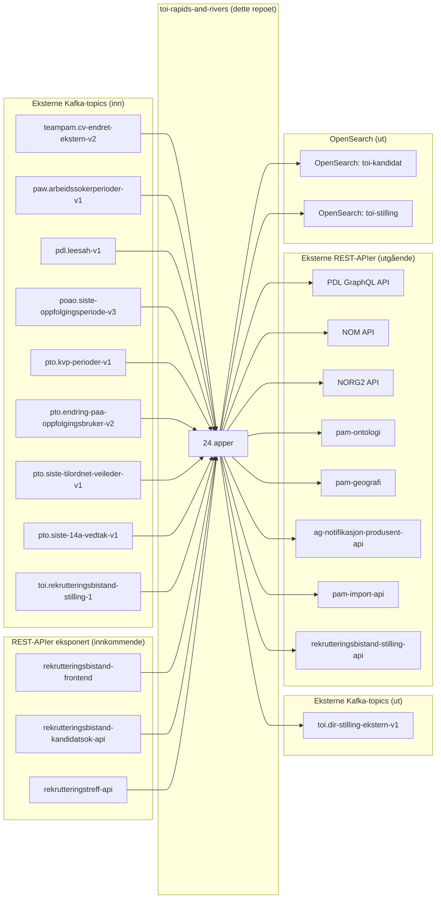

# Ekstern kommunikasjon — toi-rapids-and-rivers

Dokumentasjon over all ekstern kommunikasjon for appene i dette repoet, sett under ett.
Intern kommunikasjon (mellom appene i repoet via rapiden `toi.rapid-1`) er **ikke** inkludert.

---

## Oversikt



---

## 1. Eksterne Kafka-topics (konsumert)

| Topic | Eier | App som konsumerer | Mekanisme | Beskrivelse |
|-------|------|--------------------|-----------|-------------|
| `teampam.cv-endret-ekstern-v2` | teampam | toi-arbeidsmarked-cv | Egen consumer (Avro) | CV-endringer fra arbeidsmarkedet |
| `paw.arbeidssokerperioder-v1` | paw | toi-arbeidssoekerperiode | Egen consumer (Avro) | Arbeidssøkerperioder |
| `pdl.leesah-v1` | pdl | toi-livshendelse | Egen consumer (Avro) | Personhendelser (adressebeskyttelse) |
| `poao.siste-oppfolgingsperiode-v3` | poao | toi-siste-oppfolgingsperiode | Kafka Streams | Oppfølgingsperioder |
| `pto.kvp-perioder-v1` | pto | toi-kvp | KAFKA_EXTRA_TOPIC | KVP-perioder (startet/avsluttet) |
| `pto.endring-paa-oppfolgingsbruker-v2` | pto | toi-oppfolgingsinformasjon | KAFKA_EXTRA_TOPIC | Endring på oppfølgingsbruker |
| `pto.siste-tilordnet-veileder-v1` | pto | toi-veileder | KAFKA_EXTRA_TOPIC | Veiledertilordninger |
| `pto.siste-14a-vedtak-v1` | pto | toi-siste-14a-vedtak | KAFKA_EXTRA_TOPIC | 14a-vedtak |
| `toi.rekrutteringsbistand-stilling-1` | toi (stilling-api) | toi-stilling-indekser | Egen consumer (Avro) | Stillingsannonser |

---

## 2. Eksterne Kafka-topics (produsert)

| Topic | App som produserer | Konsumenter | Beskrivelse |
|-------|--------------------|-------------|-------------|
| `toi.dir-stilling-ekstern-v1` | toi-publiser-dir-stillinger | Ukjent/ekstern | Direktemeldte stillinger i eksternt format |

---

## 3. Rapid-topic med eksterne konsumenter/produsenter

Rapiden `toi.rapid-1` har følgende **eksterne** apper (utenfor dette repoet) med tilgang:

| App | Tilgang | Team |
|-----|---------|------|
| rekrutteringsbistand-kandidat-api | write | toi |
| foresporsel-om-deling-av-cv-api | readwrite | toi |
| rekrutteringsbistand-statistikk-api | readwrite | toi |
| rekrutteringsbistand-stilling-api | readwrite | toi |
| presenterte-kandidater-api | readwrite | toi |
| rekrutteringsbistand-kandidatvarsel-api | readwrite | toi |
| rekrutteringsbistand-aktivitetskort | readwrite | toi |
| rekrutteringstreff-api | readwrite | toi |
| pam-dir-api | read | teampam |

Disse appene publiserer hendelser (f.eks. stillingsendringer, kandidatlister) og/eller lytter på resultater (f.eks. synlighet).

---

## 4. REST-APIer konsumert (utgående kall)

| Ekstern tjeneste | URL (prod) | App som kaller | Autentisering | Beskrivelse |
|------------------|-----------|----------------|---------------|-------------|
| PDL GraphQL API | `pdl-api.prod-fss-pub.nais.io/graphql` | toi-identmapper, toi-livshendelse | Azure AD (scope: `api://prod-fss.pdl.pdl-api/.default`) | Oppslag aktørId fra fnr, adressebeskyttelse |
| NOM API | `nom-api.intern.nav.no/graphql` | toi-veileder | Azure AD (scope: `api://prod-gcp.nom.nom-api/.default`) | Veilederinformasjon (navn, kontorinfo) |
| NORG2 | `norg2.prod-fss-pub.nais.io/norg2/api/v1` | toi-organisasjonsenhet | Ingen (åpen) | NAV-kontornavn fra enhetsnummer |
| pam-ontologi | `pam-ontologi.intern.nav.no/rest/synonymer` | toi-ontologitjeneste | Ingen (åpen) | Synonymer for kompetanser og stillingstitler |
| pam-geografi | `pam-geografi.teampam` (internt) | toi-geografi | Ingen (service discovery) | Geografi fra postnummer/koder |
| ag-notifikasjon-produsent-api | `ag-notifikasjon-produsent-api.intern.nav.no` | toi-arbeidsgiver-notifikasjon | Azure AD (scope: `api://prod-gcp.fager.notifikasjon-produsent-api/.default`) | Oppretter/lukker arbeidsgivernotifikasjoner |
| pam-import-api | `pam-import-api.teampam` (internt) | toi-publisering-til-arbeidsplassen | Token (hemmelighet) | Publiserer stillinger til Arbeidsplassen |
| rekrutteringsbistand-stilling-api | `rekrutteringsbistand-stilling-api` (internt) | toi-stilling-indekser | Azure AD (scope: `api://prod-gcp.toi.rekrutteringsbistand-stilling-api/.default`) | Henter stillingsinfo, trigger reindeksering |

---

## 5. REST-APIer eksponert (innkommende kall)

| App | Endepunkt | Konsument | Autentisering | Beskrivelse |
|-----|-----------|-----------|---------------|-------------|
| toi-synlighetsmotor | `POST /evaluering` | rekrutteringsbistand-frontend/frontend2/container | Azure AD (veiledergrupper) | Evaluerer synlighet for kandidat (fnr) |
| toi-synlighetsmotor | `GET /evaluering/{fnr}` | rekrutteringsbistand-frontend/frontend2/container | Azure AD (veiledergrupper) | Henter synlighetsevaluering |
| toi-livshendelse | `POST /adressebeskyttelse` | rekrutteringsbistand-kandidatsok-api | Azure AD (veiledergrupper) | Sjekker om person har adressebeskyttelse |
| toi-arbeidsgiver-notifikasjon | `GET /template` | rekrutteringsbistand-frontend/frontend2 | Ingen (preview) | Forhåndsvisning av e-postmal |
| toi-sammenstille-kandidat | `POST /republiser` | Manuell/intern | Passord (hemmelighet) | Trigger republisering av kandidater |

---

## 6. OpenSearch

| App | OpenSearch-instans | Tilgang | Indekser | Operasjoner |
|-----|-------------------|---------|----------|-------------|
| toi-kandidat-indekser | `toi-kandidat` | admin | `kandidater-1` (alias: `kandidater`) | Indekserer/sletter kandidat-CVer |
| toi-stilling-indekser | `toi-stilling` | admin | `stilling_YYYYMMDD` (rullerende) | Indekserer stillingsannonser |

> **Viktig:** OpenSearch-indeksene er det endelige produktet — konsumert av `rekrutteringsbistand-kandidatsok-api` og saksbehandlerverktøy for å søke etter kandidater og stillinger.

---

## 7. Databaser

| App | Database | Type | Innhold |
|-----|----------|------|---------|
| toi-identmapper | identmapping-db | PostgreSQL | Mapping mellom fnr og aktørId |
| toi-sammenstille-kandidat | db | PostgreSQL | Aggregert kandidatdata fra alle kilder |
| toi-synlighetsmotor | synlighetsmotor-db | PostgreSQL | Synlighetsgrunnlag per kandidat |
| toi-arbeidssoekeropplysninger | toiarbeidssoekeropplysninger | PostgreSQL | Arbeidssøkerperioder og opplysninger |

---

## 8. Oppsummering av ekstern avhengighetskart

```
INNKOMMENDE DATA (Kafka):
  teampam    → CV-data
  paw        → Arbeidssøkerperioder
  pdl        → Personhendelser
  poao       → Oppfølgingsperioder
  pto        → KVP, oppfølgingsinfo, veileder, 14a-vedtak
  stilling-api → Stillingsannonser

BERIKELSE (REST):
  PDL        → aktørId, adressebeskyttelse
  NOM        → veilederinfo
  NORG2      → NAV-kontornavn
  pam-ontologi → synonymer
  pam-geografi → geografioppslag

UTGÅENDE DATA:
  OpenSearch (kandidater)  → kandidatsøk
  OpenSearch (stilling)    → stillingssøk
  Kafka (dir-stilling)     → ekstern publisering
  pam-import-api           → arbeidsplassen.no
  ag-notifikasjon          → arbeidsgivervarslinger

EKSPONERTE APIer:
  synlighetsmotor          → frontend (synlighetssjekk)
  livshendelse             → kandidatsøk-api (adressebeskyttelse)
  arbeidsgiver-notifikasjon → frontend (e-postmal)
```

---

---

# Konsolideringsanalyse: Fra 24 apper til 2–3

## Premiss

Alle interne meldinger over rapiden (`toi.rapid-1`) erstattes med direkte funksjonskall. 
Appene i dette repoet smeltes sammen basert på deres **eksterne grensesnitt**.

## Naturlig gruppering

Appene har tre distinkte «domener» med ulike eksterne avhengigheter:

### App 1: **toi-kandidat-pipeline** (kandidat-indeksering + synlighet)

Slår sammen **19 apper**:

| Nåværende app | Rolle i konsolidert app |
|---------------|------------------------|
| toi-arbeidsmarked-cv | Kafka-consumer modul |
| toi-arbeidssoekerperiode | Kafka-consumer modul |
| toi-livshendelse | Kafka-consumer + REST-endepunkt + PDL-klient |
| toi-siste-oppfolgingsperiode | Kafka Streams modul |
| toi-siste-oppfolgingsperiode-pond | Integrert i streams-modul |
| toi-kvp | Kafka-consumer modul (EXTRA_TOPIC) |
| toi-oppfolgingsinformasjon | Kafka-consumer modul (EXTRA_TOPIC) |
| toi-veileder | Kafka-consumer modul (EXTRA_TOPIC) + NOM-klient |
| toi-siste-14a-vedtak | Kafka-consumer modul (EXTRA_TOPIC) |
| toi-identmapper | PDL-klient modul |
| toi-sammenstille-kandidat | Repository/aggregering + REST (republisering) |
| toi-synlighetsmotor | Forretningslogikk + REST-API |
| toi-arbeidssoekeropplysninger | Repository + periodisk jobb |
| toi-organisasjonsenhet | NORG2-klient |
| toi-hull-i-cv | Ren beregning |
| toi-ontologitjeneste | pam-ontologi-klient |
| toi-geografi | pam-geografi-klient |
| toi-kandidat-indekser | OpenSearch-klient |
| toi-evaluertdatalogger | Logging (kan bli metrikker) |

**Eksterne grensesnitt:**
- **Kafka inn:** 8 topics (teampam, paw, pdl, poao, pto ×4)
- **REST ut:** PDL, NOM, NORG2, pam-ontologi, pam-geografi
- **REST inn:** `/evaluering` (synlighet), `/adressebeskyttelse`, `/republiser`
- **OpenSearch:** toi-kandidat (admin)
- **Database:** 4 PostgreSQL-instanser (kan konsolideres til 1–2)

**Arkitektur:**
```
┌─────────────────────────────────────────────────────────────────┐
│ toi-kandidat-pipeline                                           │
├─────────────────────────────────────────────────────────────────┤
│                                                                 │
│  ┌──────────────────┐    ┌─────────────┐    ┌───────────────┐  │
│  │ Kafka Consumers  │───▶│ Identmapper │───▶│ Aggregator    │  │
│  │ (8 topics)       │    │ (PDL)       │    │ (PostgreSQL)  │  │
│  └──────────────────┘    └─────────────┘    └───────┬───────┘  │
│                                                     │           │
│  ┌──────────────────┐    ┌─────────────┐    ┌──────▼────────┐  │
│  │ REST API         │◀───│ Synlighets- │◀───│ Berikere      │  │
│  │ /evaluering      │    │ motor       │    │ (NORG2,NOM,..)│  │
│  │ /adressebeskyttel│    └──────┬──────┘    └───────────────┘  │
│  └──────────────────┘           │                               │
│                          ┌──────▼──────┐                        │
│                          │ OpenSearch   │                        │
│                          │ Indekserer   │                        │
│                          └─────────────┘                        │
└─────────────────────────────────────────────────────────────────┘
```

### App 2: **toi-stilling-pipeline** (stilling-indeksering + publisering)

Slår sammen **3 apper**:

| Nåværende app | Rolle |
|---------------|-------|
| toi-stilling-indekser | Kafka-consumer + OpenSearch + stilling-api klient |
| toi-publiser-dir-stillinger | Kafka-producer (toi.dir-stilling-ekstern-v1) |
| toi-publisering-til-arbeidsplassen | REST-klient mot pam-import-api |

**Eksterne grensesnitt:**
- **Kafka inn:** `toi.rekrutteringsbistand-stilling-1`
- **Kafka ut:** `toi.dir-stilling-ekstern-v1`
- **REST ut:** rekrutteringsbistand-stilling-api, pam-import-api
- **OpenSearch:** toi-stilling (admin)

### App 3: **toi-arbeidsgiver-notifikasjon** (kan vurderes separat)

| Nåværende app | Rolle |
|---------------|-------|
| toi-arbeidsgiver-notifikasjon | Kafka-consumer + REST-klient + REST-API |

**Eksterne grensesnitt:**
- **Kafka inn:** `toi.rapid-1` (leser kandidatliste-hendelser fra eksterne apper)
- **REST ut:** ag-notifikasjon-produsent-api
- **REST inn:** `/template` (frontend)

> **Vurdering:** Denne appen har en særstilling fordi den lytter på hendelser fra **andre apper utenfor dette repoet** (via rapiden). Den publiserer ikke data tilbake, bare varsler. Den kan enten forbli separat eller absorberes i toi-kandidat-pipeline.

### Helseapp

| Nåværende app | Vurdering |
|---------------|-----------|
| toi-helseapp | Dropp. Erstattes av standard Nais-monitorering + metrikker fra de konsoliderte appene |

---

## Konsolideringsgevinster

| Aspekt | Nå (24 apper) | Etter (2–3 apper) |
|--------|---------------|-------------------|
| Deploy-enheter | 24 | 2–3 |
| Kafka consumer groups | 24+ | 2–3 |
| PostgreSQL-instanser | 4 | 1–2 |
| Replikas i prod | ~40–60 | ~6–12 |
| Nais-manifester | 24 | 2–3 |
| Latens per hendelse | Sekunder (mange rapid-hopp) | Millisekunder (direkte kall) |
| Feilsøking | Spor melding over 10+ apper | Alt i én logg-kontekst |
| Ressursforbruk | Høy (overhead per JVM) | Vesentlig lavere |

---

## Hva kreves for konsolideringen?

### Steg 1: Flytt all forretningslogikk til moduler (lav risiko)

Hver nåværende app blir en Gradle-modul (eller bare en pakke) i den nye appen.
Logikken forblir identisk — bare kommunikasjonslaget endres.

### Steg 2: Erstatt rapid-meldinger med funksjonskall

**Synlighetsmotoren** er det naturlige senterpunktet:
1. En hendelse kommer inn (f.eks. CV-endring fra Kafka)
2. Identmapper beriker med aktørId → **direkte kall**
3. Aggregator lagrer data → **direkte kall**
4. Synlighetsmotor evaluerer → **direkte kall**
5. Berikere legger til data → **direkte kall i sekvens**
6. Kandidat-indekser lagrer i OpenSearch → **direkte kall**

Den sekvensielle behovskjeden (`@behov`) blir en enkel `pipeline()`-funksjon.

### Steg 3: Håndter Kafka-consumers og Kafka Streams

Utfordring: Flere topics med ulike serialiseringsformat (Avro, JSON) og ulike consumer groups.
Løsning: Én app med flere Kafka-consumer-tråder, hver med sin group-id.

### Steg 4: Behold ekstern kompatibilitet

**Kritisk:** Rapiden `toi.rapid-1` brukes fortsatt av 9 eksterne apper (utenfor dette repoet).
Konsekvens: Den konsoliderte appen må **fortsatt publisere til og lytte på rapiden** for:
- Stillingsendringer fra `rekrutteringsbistand-stilling-api`
- Kandidatlistehendelser fra `foresporsel-om-deling-av-cv-api`
- Synlighetsresultater som `rekrutteringstreff-api` og `rekrutteringsbistand-kandidatsok-api` trenger

### Steg 5: Database-konsolidering (valgfritt)

De 4 databasene kan slås sammen til 1, men kan også beholdes separat.
Aggregatoren (`toi-sammenstille-kandidat`) sin database er den viktigste.

---

## Risiko og anbefalinger

| Risiko | Mitigering |
|--------|-----------|
| Stor endring, mye kan gå galt | Gjør det modulært — flytt én app om gangen inn i monolitten |
| Rapiden brukes av eksterne | Behold rapid-tilkobling for ekstern kommunikasjon |
| Kafka Streams krever egne instanser | Hold toi-siste-oppfolgingsperiode som eget modul med egen consumer |
| Ytelsesproblemer med én stor app | Start med 4–6 replikas, profiler |
| Mister mulighet for uavhengig skalering | Kandidat-pipeline har allerede flaskehals i OpenSearch, ikke CPU |

### Anbefalt rekkefølge

1. **Først:** Konsolider berikerne (hull-i-cv, ontologi, geografi, organisasjonsenhet) — disse er ren logikk + HTTP-kall
2. **Deretter:** Absorber identmapper og aggregator inn i synlighetsmotoren
3. **Så:** Flytt Kafka-consumers (inngangsportene) inn
4. **Til slutt:** Absorber kandidat-indekser

Stilling-pipeline kan konsolideres parallelt og uavhengig.

---

## Konklusjon

**Ja, 2 apper er realistisk:**

1. **toi-kandidat-pipeline** — alt som handler om å gjøre kandidater søkbare
2. **toi-stilling-pipeline** — alt som handler om å indeksere og publisere stillinger

`toi-arbeidsgiver-notifikasjon` kan vurderes som en del av kandidat-pipeline eller forbli separat (den har lav kobling til resten).

Synlighetsmotoren og kandidatsøket (OpenSearch) er korrekt identifisert som sentrale: 
- **Synlighetsmotoren** er hjernecellen — all data flyter gjennom den
- **OpenSearch-indeksering** er det endelige produktet — den eneste grunnen til at hele pipeline-et eksisterer
