# Meldingsflyter til kandidat-indeksering

Dokumentasjon over alle meldingsflyter på rapiden som ender med kandidat-indeksering i OpenSearch.

## Oversikt

Systemet bruker [rapids-and-rivers](https://github.com/navikt/rapids-and-rivers)-arkitekturen. Alle apper deler én Kafka-topic (rapiden). Meldinger flyter gjennom rapiden og berikes underveis av ulike apper. Flyten starter når data kommer inn fra eksterne Kafka-topics, og ender når en komplett kandidatprofil indekseres i OpenSearch.

### KAFKA_EXTRA_TOPIC-mekanismen

Rapids-and-rivers-biblioteket støtter en `KAFKA_EXTRA_TOPIC`-konfigurasjon (satt i `nais.yaml`). Når denne er satt, abonnerer appens consumer på **både** rapid-topicen (`toi.rapid-1`) og det ekstra topicet. Meldinger fra det ekstra topicet dukker opp i consumeren uten `@event_name`-felt, noe transformator-appene utnytter med `forbid("@event_name")` for å kun plukke opp rå-meldinger fra det ekstra topicet.

| App | KAFKA_EXTRA_TOPIC | Ekstern kilde |
|-----|-------------------|---------------|
| toi-kvp | `pto.kvp-perioder-v1` | KVP-perioder fra PTO |
| toi-oppfolgingsinformasjon | `pto.endring-paa-oppfolgingsbruker-v2` | Oppfølgingsbrukerendringer fra PTO |
| toi-veileder | `pto.siste-tilordnet-veileder-v1` | Veiledertilordninger fra PTO |
| toi-siste-14a-vedtak | `pto.siste-14a-vedtak-v1` | 14a-vedtak fra PTO |
| toi-siste-oppfolgingsperiode-pond | `toi.siste-oppfolgingsperiode-fra-aktorid-v1` | Re-keyet oppfølgingsperioder fra toi-siste-oppfolgingsperiode |

### Roller i arkitekturen

| Rolle | Beskrivelse | Apper |
|-------|-------------|-------|
| **Inngangsporter** | Lytter på eksterne Kafka-topics (egne consumere) og publiserer hendelser til rapiden | toi-arbeidsmarked-cv, toi-arbeidssoekerperiode, toi-livshendelse |
| **Transformatorer** | Lytter på rå-meldinger fra `KAFKA_EXTRA_TOPIC` (uten `@event_name`) og transformerer til navngitte hendelser på rapiden | toi-kvp, toi-oppfolgingsinformasjon, toi-veileder, toi-siste-14a-vedtak, toi-siste-oppfolgingsperiode-pond |
| **Identmapper** | Slår opp aktørId fra fødselsnummer via PDL og beriker meldingen | toi-identmapper |
| **Aggregator** | Samler kandidatdata fra alle kilder i en database og svarer på behov | toi-sammenstille-kandidat |
| **Synlighetsmotor** | Evaluerer om en kandidat skal være synlig i søk | toi-synlighetsmotor |
| **Berikere** | Svarer på `@behov` med tilleggsdata fra eksterne tjenester | toi-organisasjonsenhet, toi-hull-i-cv, toi-ontologitjeneste, toi-geografi, toi-arbeidssoekeropplysninger, toi-siste-oppfolgingsperiode-pond, toi-livshendelse |
| **Indekserer** | Indekserer ferdig berikede kandidater i OpenSearch | toi-kandidat-indekser |

---

## Komplett flytdiagram

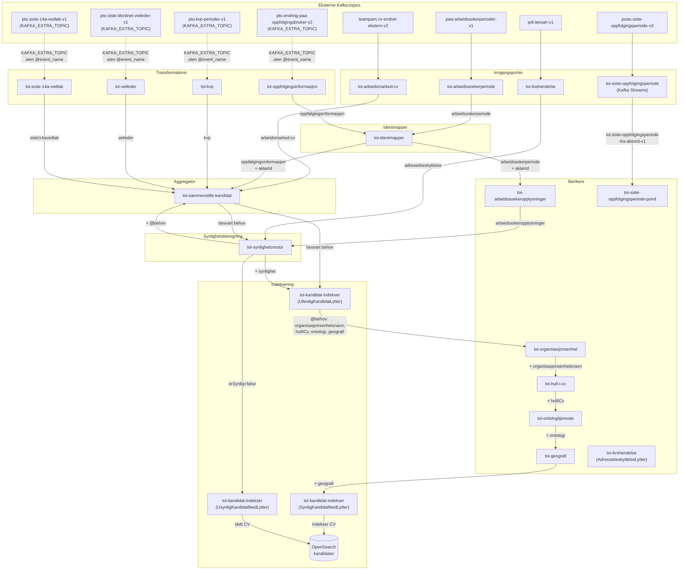

---

## Detaljerte flyter per inngangsport

### Flyt 1: CV-endring (arbeidsmarked-cv)

Trigges av endringer i en kandidats CV fra Arbeidsmarked.

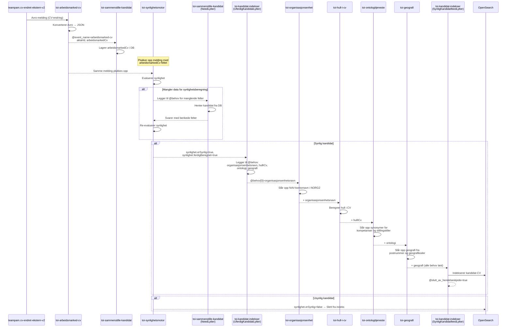

### Flyt 2: KVP-hendelse

Trigges når en bruker starter eller avslutter KVP (Kvalifiseringsprogrammet).

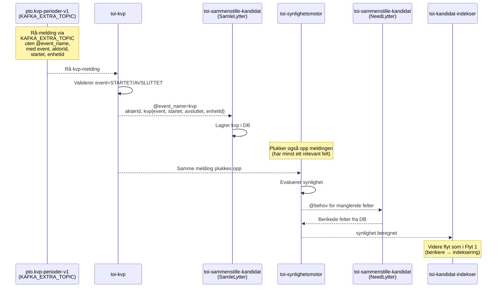

### Flyt 3: Oppfølgingsinformasjon

Trigges når oppfølgingsinformasjon endres for en bruker.

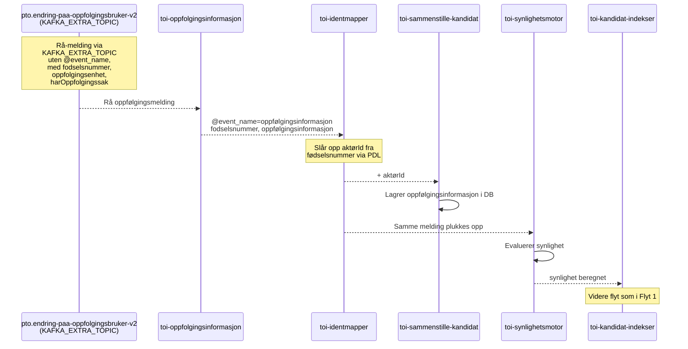

### Flyt 4: Veiledertilordning

Trigges når en veileder tilordnes en bruker.

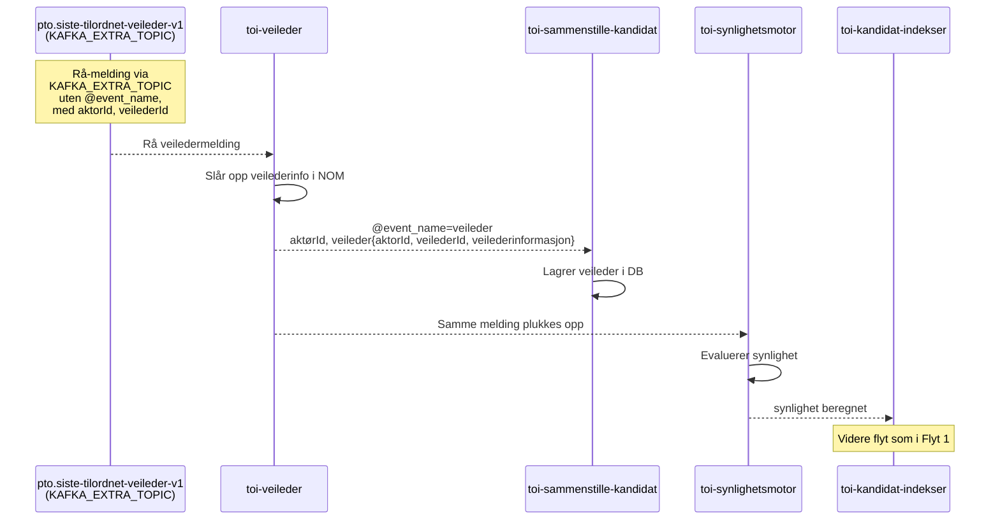

### Flyt 5: Siste 14a-vedtak

Trigges når et nytt 14a-vedtak fattes.

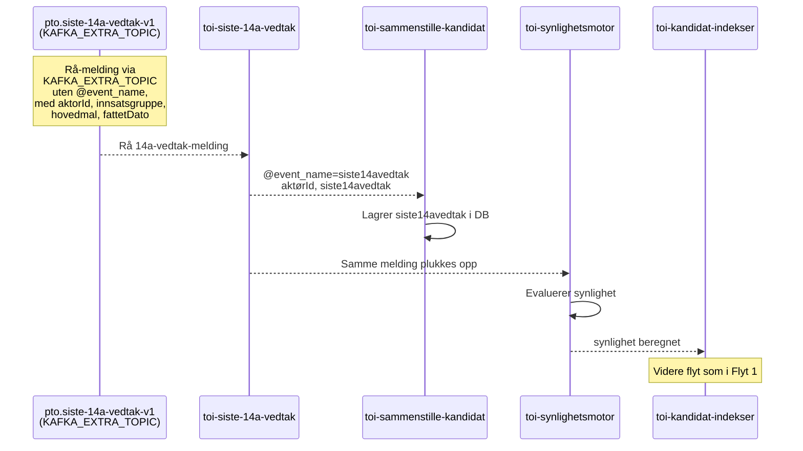

### Flyt 6: Arbeidssøkerperiode

Trigges fra arbeidssøkerregisteret.

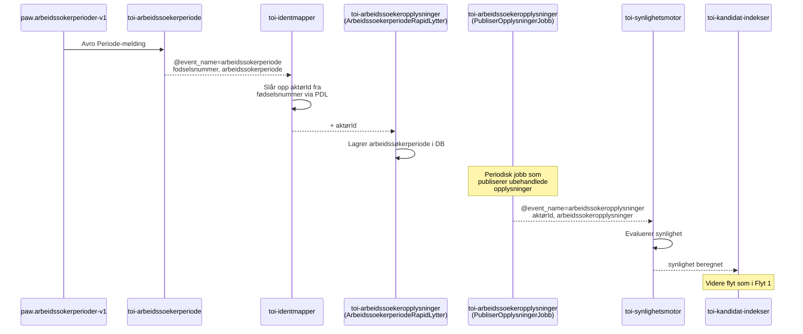

### Flyt 7: Oppfølgingsperiode

Trigges fra oppfølgingsperiode-systemet.

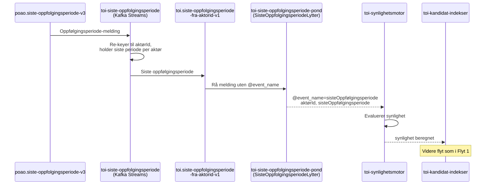

### Flyt 8: Adressebeskyttelse (livshendelse)

Trigges av adressebeskyttelse-hendelser fra PDL.

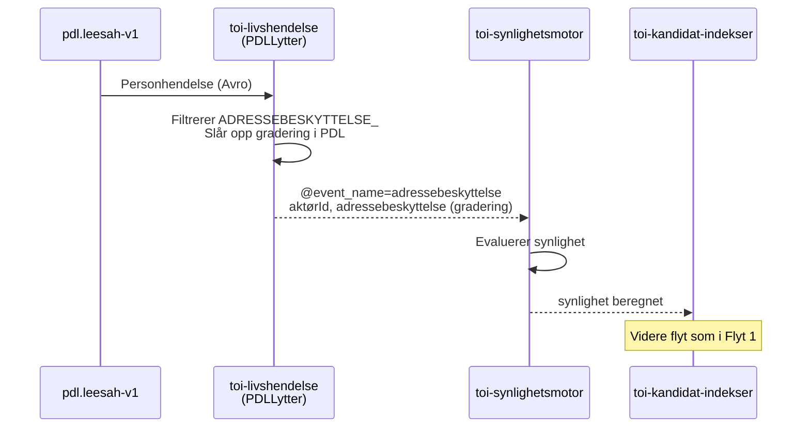

---

## Behovsmekanismen (@behov)

Meldinger berikes stegvis gjennom et behovsmønster. Når en app mangler data, legger den til felter i `@behov`-arrayet. Berikere plukker opp meldingen når deres behov er det **første uløste** i listen.

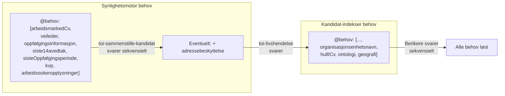

### Behovskjeden for berikere (kandidat-indekser)

Berikerne svarer i rekkefølge basert på det første uløste behovet:

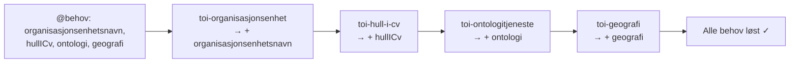

---

## Synlighetsregler

`toi-synlighetsmotor` evaluerer følgende kriterier for at en kandidat skal være synlig:

| Kriterium | Datakilde | Regel |
|-----------|-----------|-------|
| Har aktiv CV | arbeidsmarkedCv | meldingstype er OPPRETT eller ENDRE |
| Har oppfølging | sisteOppfølgingsperiode | startdato er i fortid OG sluttdato er null eller i fremtid |
| Riktig formidlingsgruppe | oppfølgingsinformasjon | formidlingsgruppe == ARBS |
| Ikke kode 6/7 | oppfølgingsinformasjon | diskresjonskode ikke er "6" eller "7" |
| Ikke sperret ansatt | oppfølgingsinformasjon | sperretAnsatt == false |
| Ikke død | oppfølgingsinformasjon | erDoed == false |
| Ikke i KVP | kvp | event != STARTET |
| Ingen adressebeskyttelse | adressebeskyttelse | gradering er UGRADERT eller UKJENT |
| Er arbeidssøker | arbeidssokeropplysninger | periodeStartet != null OG periodeAvsluttet == null |

Alle kriterier må være oppfylt for at kandidaten skal være synlig (`erSynlig=true`).

---

## Meldinger og @event_name-oversikt

| @event_name | Produsent | Konsumenter |
|-------------|-----------|-------------|
| `arbeidsmarked-cv` | toi-arbeidsmarked-cv | toi-sammenstille-kandidat (SamleLytter) |
| `kvp` | toi-kvp | toi-sammenstille-kandidat (SamleLytter) |
| `oppfølgingsinformasjon` | toi-oppfolgingsinformasjon | toi-identmapper → toi-sammenstille-kandidat |
| `veileder` | toi-veileder | toi-sammenstille-kandidat (SamleLytter) |
| `siste14avedtak` | toi-siste-14a-vedtak | toi-sammenstille-kandidat (SamleLytter) |
| `arbeidssokerperiode` | toi-arbeidssoekerperiode | toi-identmapper → toi-arbeidssoekeropplysninger |
| `arbeidssokeropplysninger` | toi-arbeidssoekeropplysninger | toi-synlighetsmotor |
| `sisteOppfølgingsperiode` | toi-siste-oppfolgingsperiode-pond | toi-synlighetsmotor |
| `adressebeskyttelse` | toi-livshendelse | toi-synlighetsmotor |
| `republisert` | toi-sammenstille-kandidat (manuell) | Alle lyttere (starter full re-flyt) |

---

## Applikasjoner som IKKE inngår i kandidat-indeksering

Følgende apper i repoet har andre formål og er ikke del av flyten til kandidat-indeksering:

- **toi-arbeidsgiver-notifikasjon** – Håndterer notifikasjoner til arbeidsgivere
- **toi-evaluertdatalogger** – Logger data fra republiserte meldinger
- **toi-helseapp** – Helsesjekk og monitorering av rapiden
- **toi-stilling-indekser** – Indekserer stillinger (separat flyt)
- **toi-publiser-dir-stillinger** – Publiserer direktemeldte stillinger
- **toi-publisering-til-arbeidsplassen** – Publiserer stillinger til Arbeidsplassen
