# Meldingsflyter til kandidat-indeksering

Dokumentasjon over alle meldingsflyter på rapiden som ender med kandidat-indeksering i OpenSearch.

## Oversikt

Systemet bruker [rapids-and-rivers](https://github.com/navikt/rapids-and-rivers)-arkitekturen. Alle apper deler én Kafka-topic (rapiden). Meldinger flyter gjennom rapiden og berikes underveis av ulike apper. Flyten starter når data kommer inn fra eksterne Kafka-topics, og ender når en komplett kandidatprofil indekseres i OpenSearch.

### KAFKA_EXTRA_TOPIC-mekanismen

Rapids-and-rivers-biblioteket støtter en `KAFKA_EXTRA_TOPIC`-konfigurasjon (satt i `nais.yaml`). Når denne er satt, abonnerer appens consumer på **både** rapid-topicen (`toi.rapid-1`) og det ekstra topicet. Meldinger fra det ekstra topicet dukker opp i consumeren uten `@event_name`-felt, noe transformator-appene utnytter med `forbid("@event_name")` for å kun plukke opp rå-meldinger fra det ekstra topicet.

| App | KAFKA_EXTRA_TOPIC | Ekstern kilde |
|-----|-------------------|---------------|
| toi-kvp | `pto.kvp-perioder-v1` | KVP-perioder fra PTO |
| toi-oppfolgingsinformasjon | `pto.endring-paa-oppfolgingsbruker-v2` | Oppfølgingsbrukerendringer fra PTO |
| toi-veileder | `pto.siste-tilordnet-veileder-v1` | Veiledertilordninger fra PTO |
| toi-siste-14a-vedtak | `pto.siste-14a-vedtak-v1` | 14a-vedtak fra PTO |
| toi-siste-oppfolgingsperiode-pond | `toi.siste-oppfolgingsperiode-fra-aktorid-v1` | Re-keyet oppfølgingsperioder fra toi-siste-oppfolgingsperiode |

### Roller i arkitekturen

| Rolle | Beskrivelse | Apper |
|-------|-------------|-------|
| **Inngangsporter** | Lytter på eksterne Kafka-topics (egne consumere) og publiserer hendelser til rapiden | toi-arbeidsmarked-cv, toi-arbeidssoekerperiode, toi-livshendelse |
| **Transformatorer** | Lytter på rå-meldinger fra `KAFKA_EXTRA_TOPIC` (uten `@event_name`) og transformerer til navngitte hendelser på rapiden | toi-kvp, toi-oppfolgingsinformasjon, toi-veileder, toi-siste-14a-vedtak, toi-siste-oppfolgingsperiode-pond |
| **Identmapper** | Slår opp aktørId fra fødselsnummer via PDL og beriker meldingen | toi-identmapper |
| **Aggregator** | Samler kandidatdata fra alle kilder i en database og svarer på behov | toi-sammenstille-kandidat |
| **Synlighetsmotor** | Evaluerer om en kandidat skal være synlig i søk | toi-synlighetsmotor |
| **Berikere** | Svarer på `@behov` med tilleggsdata fra eksterne tjenester | toi-organisasjonsenhet, toi-hull-i-cv, toi-ontologitjeneste, toi-geografi, toi-arbeidssoekeropplysninger, toi-siste-oppfolgingsperiode-pond, toi-livshendelse |
| **Indekserer** | Indekserer ferdig berikede kandidater i OpenSearch | toi-kandidat-indekser |

---

## Komplett flytdiagram

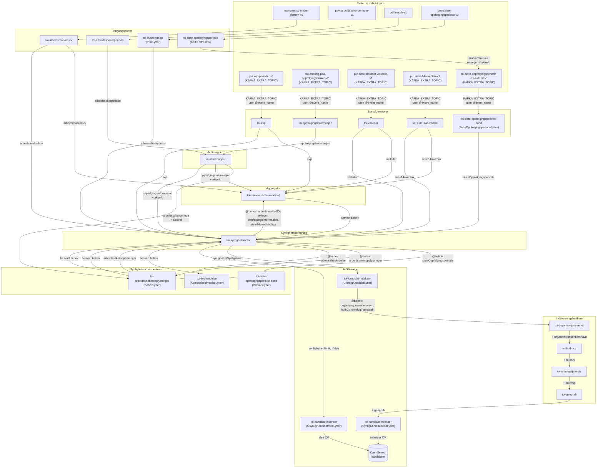

> **Merk:** Alle meldinger publiseres til den felles rapiden (`toi.rapid-1`). Pilene viser logisk meldingsflyt — meldingen publiseres til rapiden og plukkes opp av lyttere som matcher meldingsinnholdet. Flere apper kan plukke opp samme melding (f.eks. går `arbeidsmarked-cv` til **både** `toi-sammenstille-kandidat` og `toi-synlighetsmotor`). Behovskjeden (`@behov`) løses sekvensielt — det **første uløste behovet** i listen avgjør hvilken beriker som plukker opp meldingen.

---

## Detaljerte flyter per inngangsport

### Flyt 1: CV-endring (arbeidsmarked-cv)

Trigges av endringer i en kandidats CV fra Arbeidsmarked.

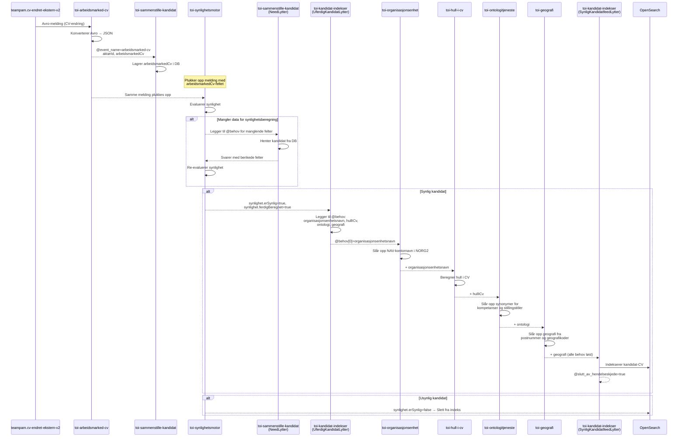

### Flyt 2: KVP-hendelse

Trigges når en bruker starter eller avslutter KVP (Kvalifiseringsprogrammet).

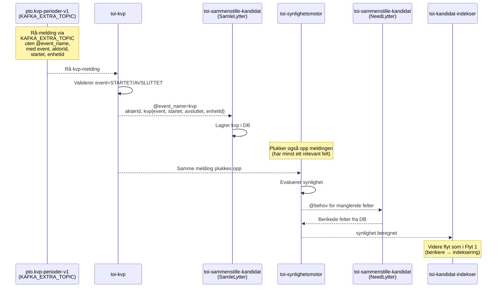

### Flyt 3: Oppfølgingsinformasjon

Trigges når oppfølgingsinformasjon endres for en bruker.

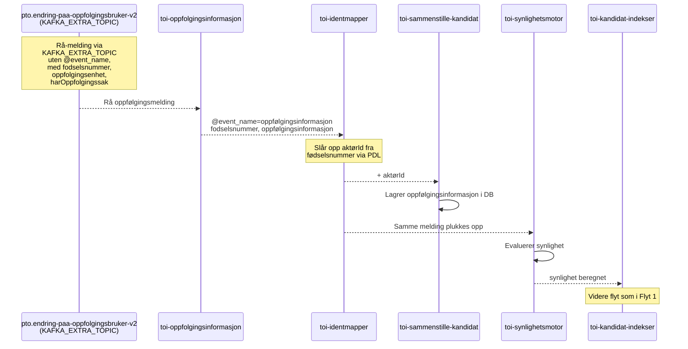

### Flyt 4: Veiledertilordning

Trigges når en veileder tilordnes en bruker.

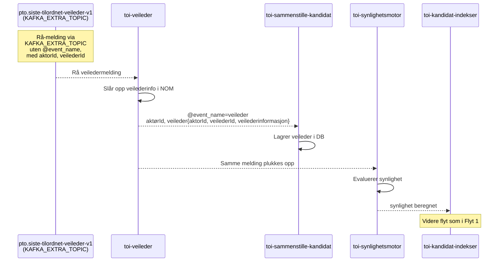

### Flyt 5: Siste 14a-vedtak

Trigges når et nytt 14a-vedtak fattes.

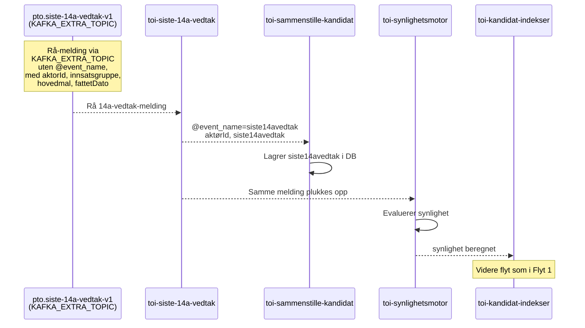

### Flyt 6: Arbeidssøkerperiode

Trigges fra arbeidssøkerregisteret.

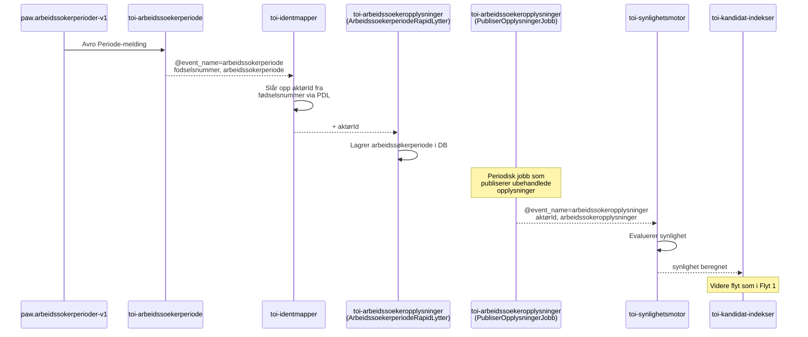

### Flyt 7: Oppfølgingsperiode

Trigges fra oppfølgingsperiode-systemet.

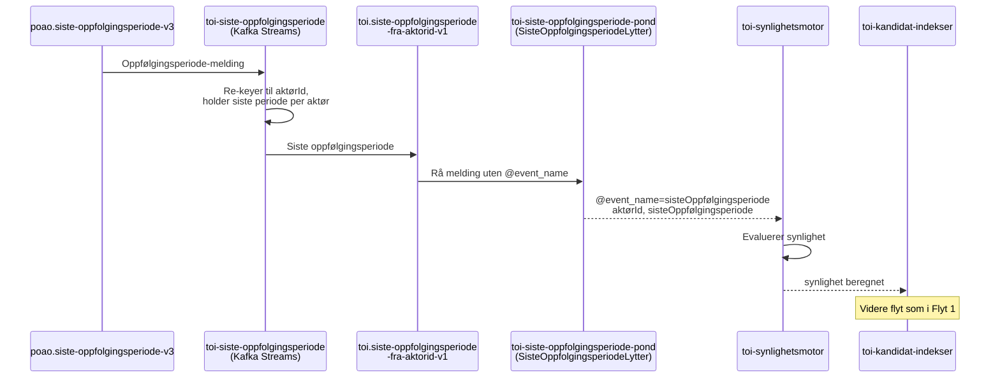

### Flyt 8: Adressebeskyttelse (livshendelse)

Trigges av adressebeskyttelse-hendelser fra PDL.

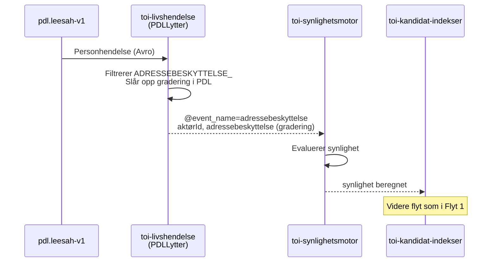

---

## Behovsmekanismen (@behov) — Document-oriented Messaging

### Konseptuell bakgrunn

Behovsmønsteret i dette systemet er en implementasjon av **Document Message**-mønsteret fra *Enterprise Integration Patterns* (Hohpe & Woolf, 2003). I stedet for å sende små, spesialiserte kommandoer mellom tjenester, sender systemet ett stort JSON-dokument som flyter gjennom en kjede av berikere. Hver beriker leser fra dokumentet, legger til sin del, og publiserer det tilbake.

Dette er også kjernen i det Greg Young beskriver i sine foredrag om **Document-oriented Messaging**: i stedet for at en orkestrator koordinerer mange request/response-kall til ulike tjenester, lar man **dokumentet selv** flyte gjennom systemet. Hver tjeneste som ser dokumentet kan lese det den trenger og skrive tilbake det den kan bidra med. Dokumentet blir en slags "reisende mappe" som samler informasjon underveis.

### Hvordan det fungerer i praksis

I dette systemet brukes et JSON-felt kalt `@behov` som en **behovsliste** — et array av strenger som angir hvilke datafelter som mangler:

```json
{
  "aktørId": "123",
  "@behov": ["arbeidsmarkedCv", "veileder", "oppfølgingsinformasjon", "siste14avedtak", "kvp"],
  "arbeidsmarkedCv": null,
  "veileder": null
}
```

Regelen er enkel: **det første uløste behovet i listen avgjør hvem som plukker opp meldingen**. Et behov er "uløst" hvis det tilhørende feltet mangler i dokumentet (`isMissingNode`). Når en beriker har lagt til sitt felt, publiserer den hele dokumentet tilbake til rapiden. Da er neste behov i listen det første uløste, og neste beriker plukker opp meldingen.

#### Valideringslogikken (`demandAtFørstkommendeUløsteBehovEr`)

Berikerne bruker en felles valideringsfunksjon som avgjør om de skal reagere på en melding:

```kotlin
// Forenklet fremstilling av logikken
fun demandAtFørstkommendeUløsteBehovEr(informasjonsElement: String) {
    require("@behov") { behovNode ->
        val førsteManglendeElement = behovNode
            .map(JsonNode::asText)         // ["arbeidsmarkedCv", "veileder", ...]
            .onEach { interestedIn(it) }   // Registrer interesse i alle felter
            .first { this[it].isMissingNode } // Finn det første feltet som mangler

        if (førsteManglendeElement != informasjonsElement)
            throw Exception("Uinteressant hendelse") // Ikke mitt behov — ignorer
    }
}
```

Denne funksjonen itererer gjennom `@behov`-listen og finner det **første elementet** som ennå ikke finnes i dokumentet. Hvis dette elementet matcher beriker-appens ansvarsfelt, plukker den opp meldingen. Ellers ignoreres den.

### Steg-for-steg eksempel

Her er et konkret eksempel på hvordan en melding berikes gjennom behovskjeden. Anta at en CV-endring trigger synlighetsmotor, og synlighetsmotor ser at bare `arbeidsmarkedCv` finnes:

```
Steg 1: toi-synlighetsmotor
  - Ser at mange felter mangler
  - Legger til @behov: [arbeidsmarkedCv, veileder, oppfølgingsinformasjon,
                         siste14avedtak, sisteOppfølgingsperiode, kvp,
                         arbeidssokeropplysninger]
  - arbeidsmarkedCv finnes allerede → første ULØSTE behov er "veileder"
  - Publiserer til rapiden

Steg 2: toi-sammenstille-kandidat (NeedLytter for "veileder")
  - Ser at første uløste behov er "veileder" → plukker opp
  - Henter kandidat fra DB, legger til veileder-feltet
  - Publiserer til rapiden
  - Neste uløste behov er nå "oppfølgingsinformasjon"

Steg 3: toi-sammenstille-kandidat (NeedLytter for "oppfølgingsinformasjon")
  - Plukker opp, legger til oppfølgingsinformasjon
  - ... og slik fortsetter det for siste14avedtak og kvp

Steg 4: toi-siste-oppfolgingsperiode-pond (BehovsLytter)
  - Første uløste behov er nå "sisteOppfølgingsperiode"
  - Henter siste oppfølgingsperiode fra KTable, legger til
  - Publiserer til rapiden

Steg 5: toi-arbeidssoekeropplysninger (BehovLytter)
  - Første uløste behov er nå "arbeidssokeropplysninger"
  - Henter fra DB, legger til
  - Publiserer til rapiden

Steg 6: toi-synlighetsmotor
  - Alle behov er besvart → evaluerer synlighet
  - Hvis alt bortsett fra adressebeskyttelse er OK:
    legger til @behov: [... , adressebeskyttelse]
  - Publiserer til rapiden

Steg 7: toi-livshendelse (AdressebeskyttelseLytter)
  - Første uløste behov er "adressebeskyttelse"
  - Slår opp gradering i PDL
  - Legger til adressebeskyttelse-feltet
  - Publiserer til rapiden

Steg 8: toi-synlighetsmotor
  - Nå er ALT komplett → beregner synlighet
  - Legger til synlighet = { erSynlig: true/false, ferdigBeregnet: true }
  - Publiserer til rapiden → plukkes opp av toi-kandidat-indekser
```

### Mønsteret visualisert

Dokumentet vokser for hver beriker som behandler det:

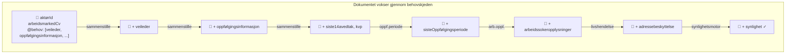

### Kobling til Enterprise Integration Patterns

| EIP-mønster | Bruk i dette systemet |
|-------------|----------------------|
| **Document Message** | Hele kandidatprofilen sendes som ett JSON-dokument som berikes underveis |
| **Content-Based Router** | `demandAtFørstkommendeUløsteBehovEr()` fungerer som en implisitt router — det er meldingsinnholdet (hvilke felter som mangler) som avgjør hvem som plukker opp |
| **Content Enricher** | Hver beriker (organisasjonsenhet, hull-i-cv, geografi, etc.) legger til data fra eksterne kilder |
| **Pipes and Filters** | Meldingen flyter sekvensielt gjennom berikere, der hver fungerer som et filter som beriker dokumentet |
| **Claim Check** | `toi-sammenstille-kandidat` fungerer delvis som et Claim Check — den lagrer data i en database og henter den tilbake når behovet oppstår, i stedet for at all data må være i meldingen fra starten |

### Kobling til Greg Youngs Document-oriented Messaging

Greg Young argumenterer for at tradisjonell orkestrert request/response-kommunikasjon mellom mikrotjenester fører til tett kobling og skjøre systemer. I stedet foreslår han at man lar **dokumentet flyte gjennom systemet** som en "reisende mappe":

- **Ingen sentral orkestrator**: Det er ingen tjeneste som koordinerer alle kall. Synlighetsmotor vet ikke hvilke berikere som finnes — den bare publiserer et dokument med behov, og riktig beriker plukker det opp.
- **Lav kobling**: Berikerne kjenner bare til rapiden og sitt eget behovsnavn. De vet ikke hvem som kommer før eller etter i kjeden.
- **Idempotent berikelse**: Hvis en beriker allerede har lagt til sitt felt, vil den ikke plukke opp meldingen igjen (fordi feltet ikke lenger er "uløst").
- **Feiltolerant**: Hvis en beriker er nede, stopper meldingen der den er. Når berikeren kommer tilbake, plukker den opp meldingen og kjeden fortsetter.

### Nåværende arkitektur: to mønstre i sameksistens

I dag bruker systemet en blanding av to mønstre for å samle kandidatdata:

**Mønster 1: Database-lagring via toi-sammenstille-kandidat (eldre)**

Datakilder som arbeidsmarkedCv, veileder, oppfølgingsinformasjon, siste14avedtak og kvp lagres i en PostgreSQL-database av `toi-sammenstille-kandidat` (SamleLytter). Når synlighetsmotor trenger disse dataene, sender den et `@behov`, og `toi-sammenstille-kandidat` (NeedLytter) henter dem fra databasen og legger dem på meldingen.

Dette er i praksis et **Claim Check**-mønster: dataene tas av meldingen, lagres et annet sted, og hentes tilbake senere.

**Mønster 2: Ren behovskjede uten database (nyere)**

Datakilder som sisteOppfølgingsperiode, arbeidssokeropplysninger og adressebeskyttelse har egne behov-berikere (`toi-siste-oppfolgingsperiode-pond`, `toi-arbeidssoekeropplysninger`, `toi-livshendelse`) som svarer direkte på `@behov` — uten å gå via toi-sammenstille-kandidat. Disse berikerne henter data fra sin egen kilde (KTable, egen database, PDL-oppslag) og legger det rett på meldingen.

Dette er det rene **Document Message**-mønsteret: dokumentet flyter gjennom berikere som hver legger til sin del, uten en sentral database som mellomledd.

**Retningen videre**

Planen er å fase ut toi-sammenstille-kandidat og gå over til det rene behovskjede-mønsteret for alle datakilder. I praksis betyr det at hver datakilde (veileder, oppfølgingsinformasjon, siste14avedtak, kvp, arbeidsmarkedCv) får sin egen behov-beriker som svarer direkte på `@behov` — på samme måte som toi-siste-oppfolgingsperiode-pond og toi-arbeidssoekeropplysninger allerede gjør.

Fordeler med det rene behovskjede-mønsteret:

- **Eliminerer sentral database**: toi-sammenstille-kandidat sin PostgreSQL-database er en single point of failure og en flaskehals. Uten den trenger ingen app å holde en komplett kopi av alle kandidatdata.
- **Enklere å legge til nye datakilder**: En ny datakilde trenger bare å implementere en behov-beriker som svarer på sitt felt. Ingen endring i toi-sammenstille-kandidat.
- **Bedre separasjon av ansvar**: Hver app eier sin egen data og vet best hvordan den skal hentes og berikes.
- **Konsistent arkitektur**: Alle datakilder følger samme mønster i stedet for at noen går via database og andre ikke.

### Behovskjeden for indekseringsberikere (kandidat-indekser)

Etter at synlighet er beregnet, legger `UferdigKandidatLytter` i toi-kandidat-indekser til et nytt sett med behov for å berike CV-data til søkeindeksen:

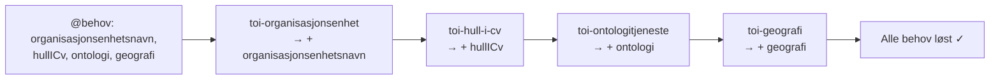

---

## Synlighetsregler

`toi-synlighetsmotor` evaluerer følgende kriterier for at en kandidat skal være synlig:

| Kriterium | Datakilde | Regel |
|-----------|-----------|-------|
| Har aktiv CV | arbeidsmarkedCv | meldingstype er OPPRETT eller ENDRE |
| Har oppfølging | sisteOppfølgingsperiode | startdato er i fortid OG sluttdato er null eller i fremtid |
| ~~Riktig formidlingsgruppe~~ | ~~oppfølgingsinformasjon~~ | ~~formidlingsgruppe == ARBS~~ — **inaktiv** (kommentert ut i `Evaluering.kt`: *"ARBS skal ikke lenger være en del av evalueringen. Kommentert ut frem til vi er sikre på at det kan slettes helt"*) |
| Ikke kode 6/7 | oppfølgingsinformasjon | diskresjonskode ikke er "6" eller "7" |
| Ikke sperret ansatt | oppfølgingsinformasjon | sperretAnsatt == false |
| Ikke død | oppfølgingsinformasjon | erDoed == false |
| Ikke i KVP | kvp | event != STARTET |
| Ingen adressebeskyttelse | adressebeskyttelse | gradering er UGRADERT eller UKJENT |
| Er arbeidssøker | arbeidssokeropplysninger | periodeStartet != null OG periodeAvsluttet == null |

Alle kriterier må være oppfylt for at kandidaten skal være synlig (`erSynlig=true`).

---

## Meldinger og @event_name-oversikt

| @event_name | Produsent | Konsumenter |
|-------------|-----------|-------------|
| `arbeidsmarked-cv` | toi-arbeidsmarked-cv | toi-sammenstille-kandidat (SamleLytter) |
| `kvp` | toi-kvp | toi-sammenstille-kandidat (SamleLytter) |
| `oppfølgingsinformasjon` | toi-oppfolgingsinformasjon | toi-identmapper → toi-sammenstille-kandidat |
| `veileder` | toi-veileder | toi-sammenstille-kandidat (SamleLytter) |
| `siste14avedtak` | toi-siste-14a-vedtak | toi-sammenstille-kandidat (SamleLytter) |
| `arbeidssokerperiode` | toi-arbeidssoekerperiode | toi-identmapper → toi-arbeidssoekeropplysninger |
| `arbeidssokeropplysninger` | toi-arbeidssoekeropplysninger | toi-synlighetsmotor |
| `sisteOppfølgingsperiode` | toi-siste-oppfolgingsperiode-pond | toi-synlighetsmotor |
| `adressebeskyttelse` | toi-livshendelse | toi-synlighetsmotor |
| `republisert` | toi-sammenstille-kandidat (manuell) | Alle lyttere (starter full re-flyt) |

---

## SynlighetRekrutteringstreffLytter — eksponert synlighetsspørring

`toi-synlighetsmotor` inneholder en ny lytter, `SynlighetRekrutteringstreffLytter`, som **ikke** er del av kandidat-indekseringsflyten. Den lar eksterne systemer (f.eks. rekrutteringstreff) spørre om en kandidats synlighet via rapiden.

### Hvordan det fungerer

Lytteren følger need-patternet:

1. Et eksternt system sender en melding på rapiden med `@behov: ["synlighetRekrutteringstreff"]` og `fodselsnummer`.
2. `SynlighetRekrutteringstreffLytter` plukker opp meldingen som første uløste behov.
3. Den slår opp evalueringen for fødselsnummeret i synlighetsmotor sin database.
   - Hvis personen ikke finnes, eller allerede er usynlig (`kanBliSynlig() == false`), besvares direkte med `erSynlig: false`.
   - Ellers trigges et `adressebeskyttelse`-behov. Når `toi-livshendelse` (AdressebeskyttelseLytter) svarer, evalueres synlighet fullstendig.
4. Lytteren publiserer meldingen tilbake med feltet `synlighetRekrutteringstreff: { erSynlig, ferdigBeregnet }` utfylt.

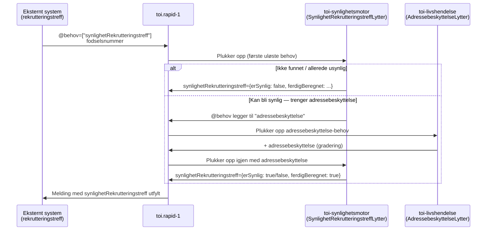

> **Merk:** Denne flyten er uavhengig av kandidat-indekseringsflyten. Den bruker synlighetsmotor sin database (som holdes oppdatert av den ordinære indekseringsflyten) og PDL-oppslag via `toi-livshendelse`, men resultatet indekseres **ikke** i OpenSearch — det returneres direkte til det spørrende systemet på rapiden.

---

## Applikasjoner som IKKE inngår i kandidat-indeksering

Følgende apper i repoet har andre formål og er ikke del av flyten til kandidat-indeksering:

- **toi-arbeidsgiver-notifikasjon** – Håndterer notifikasjoner til arbeidsgivere
- **toi-evaluertdatalogger** – Logger data fra republiserte meldinger
- **toi-helseapp** – Helsesjekk og monitorering av rapiden
- **toi-stilling-indekser** – Indekserer stillinger (separat flyt)
- **toi-publiser-dir-stillinger** – Publiserer direktemeldte stillinger
- **toi-publisering-til-arbeidsplassen** – Publiserer stillinger til Arbeidsplassen
