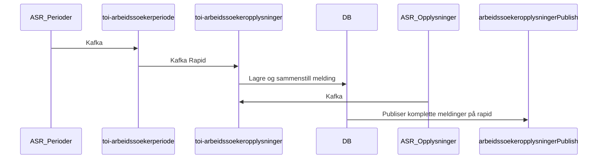

# Oppfølgingsperioder og informasjon fra ASR

ASR er Arbeidssøkerregisteret.

toi-arbeidssoekerperiode mottar kafkameldinger med arbeidssøkerperioder fra ASR.
Disse publiseres på rapid.

toi-arbeidsoekeropplysninger leser disse meldingene fra rapid'en og lagrer de i en database.

toi-arbeidsoekeropplysninger mottar kafkameldinger med arbeidssøkeropplysninger fra ASR.
Disse lagres i en database og sammenstilles med periodemeldingene.
Dette er nødvendig siden kun periodemeldingen inneholder identitetsnummer (fnr/dnr).
Opplysningermeldingen inneholder en referanse til periodemeldingen slik at disse må
sammenstilles for at vi skal vite hvem opplysningene gjelder.

TODO: toi-arbeidsoekeropplysninger leser sammenstilte rader i databasen og publiserer de på rapid'en.

